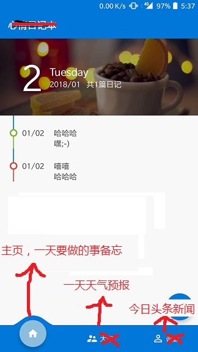
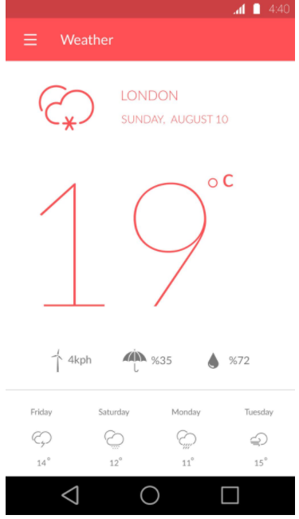
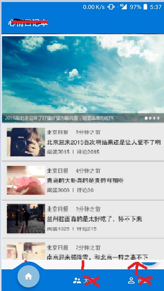

#安卓期末项目
名字：早安app

### 页面：
1、主页面，今天的备忘录

2、天气界面，简约，大概长这样（根据API信息调整）：

3、新闻界面，新闻api里面的头条信息，大概长这样（根据API信息调整）：

### 需要完成的工作：
根据功能和页面，能够分成需要完成的工作有：
1. 基本逻辑和UI，界面跳转运用到了fragment
2. 主页面的UI和后台处理
3. 天气预报的UI和后台处理
4. 新闻的UI和后台处理
5. 时间充足的话可以搞个widget啥的
6. 整合
7. 实验文档编写、需要的话还有视频的录制等

### 可能用到的知识：
1. 基本布局，fragment
2. 主页面可能用到数据库，因为需要进行数据的恢复，可能用到recyclerview
3. 网络访问，使用API。API我已经申请好了：
- 新闻头条API：https://www.juhe.cn/docs/api/id/235
- 天气预报API：https://www.juhe.cn/docs/api/id/39
使用的是聚合数据的API。
帐号：15625777339
密码：android123

### 注意事项：
1. 为了方便整合，注意文件起名字的方式。
2. 网络访问的代码可以复用。
3. 把对应的代码文件交给整合的人，不必整个项目，最好写上说明，或者找个时间一起整合？

### 分工：

